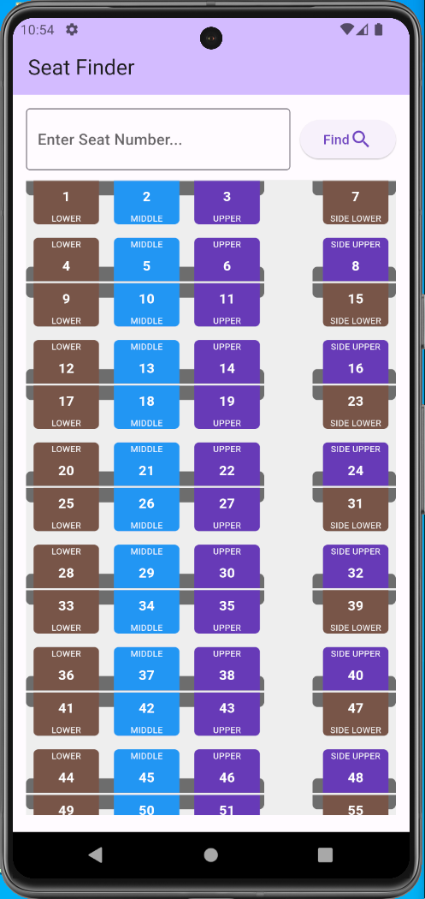
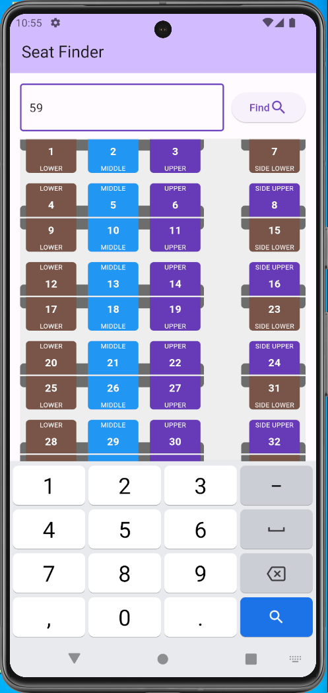
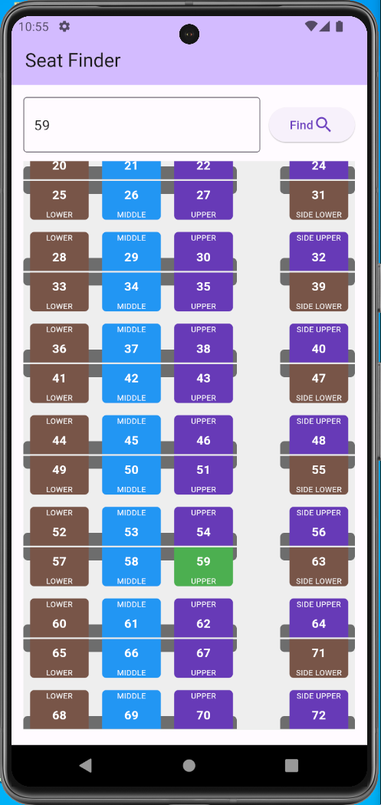

# Train Seat Finder

## Table of Contents

- [Description](#description)
- [Demo](#demo)
- [Screenshots](#screenshots)
- [Methodology](#methodology)
- [Installation](#installation)
- [Usage](#usage)
- [Author](#author)

## Description

This is a simple hybrid application that is developed using Flutter Framework.
This app allows users to find the seat location and berth type on a train bogey based on their seat number.

## Demo

https://github.com/mazam5/TrainSeatFinderFlutterApp/assets/33384508/e8894ec7-0f41-4087-a345-ab31d3162e51

<video width="320" height="240" controls>
  <source src="/demo/demo.mp4" type="video/mp4">
</video>

## Screenshots

<table>
   <tr>
      <td>Initial Screen</td>
      <td>Searching for seat</td>
      <td>Seat found</td>
   </tr>
  <tr>
    <td></td>
    <td></td>
    <td></td>
  </tr>
</table>

## Methodology

Build a simple UI with a TextFormField and a ElevatedButton widget. When the user enters a seat number and clicks on the button, the seat with the entered number and it shows a green colored box.

Widget used:

- SeatFinderWidget (StatefulWidget) - This widget contains Search widget and a SizedBox. When the user clicks on the button, the seat number is passed to the AllSeatsWidget to find the seat.

- SearchWidget (StatefulWidget) - This widget contains a TextFormField and a ElevatedButton widget. When the user clicks on the button, the seat number is passed to the AllSeatsWidget to find the seat.

- AllSeatsWidget (StatefulWidget) - This widget contains a ListView widget which displays the outlines of the seats.

- SeatTile (StatelessWidget) - This widget defines the UI of the seat. It contains a Container widget with a Text widget inside it.

- scrollToSearchController (ScrollController) - This controller is used to scroll to the searched seat when the user clicks on the find button (animateTo).

## Installation

#### Prerequisites

- [Flutter SDK](https://flutter.dev/docs/get-started/install) - Flutter SDK must be installed and configured in your machine
- [VS Code](https://code.visualstudio.com/) or [Android Studio](https://developer.android.com/studio) or [Xcode](https://developer.apple.com/xcode/)

1. Clone the repository

   ```
   git clone https://github.com/mazam5/TrainSeatFinderFlutterApp
   ```

2. Open the project in VS Code or Android Studio or Xcode

   Run below command to install flutter dependency packages

   ```
   flutter pub get
   ```

3. Run below command to check if the device is connected

   Start the emulator or connect the device to your machine

   ```
   flutter devices
   ```

4. Run to start the application

   ```
   flutter run
   ```

## Usage

1. Enter the seat number in the text field.
2. Click on the `Find` button to find the seat, berth type, and scroll to it.
3. The seat with the entered number is highlighted with a green color.

## Author

- [Mohammed Azam](https://www.linkedin.com/in/azam5/)
